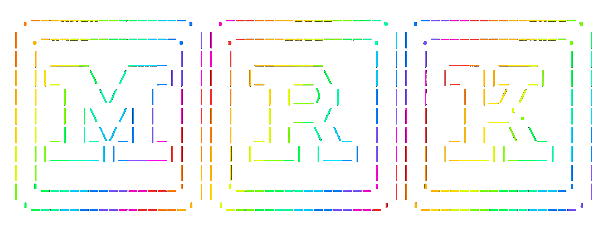

<div align="center">
  
</div>

# mrk — macOS bootstrap

Personal, opinionated macOS bootstrap tailored to my workflow and toolset. Idempotent setup in three phases.

**[Full workflow manual →](https://sevmorris.github.io/mrk/)**

## Quick Start

```bash
git clone https://github.com/sevmorris/mrk.git ~/mrk
cd ~/mrk
make install
make brew
make post-install
exec zsh
```

## Phases

| Phase | Command | What it does |
|-------|---------|--------------|
| **1 — Setup** | `make install` | Xcode CLI tools, dotfile symlinks, tool linking, macOS defaults, login shell |
| **2 — Brew** | `make brew` | Installs Homebrew, then interactively selects formulae & casks from `Brewfile` |
| **3 — Post-install** | `make post-install` | App preferences, browser policies, login items |

Run `make all` to execute all three phases at once. Phases are independent — run any subset, in any order, as many times as you want.

## Make Targets

| Target | Description |
|--------|-------------|
| `make install` / `make setup` | Phase 1 (setup) |
| `make brew` | Phase 2 (Homebrew) |
| `make post-install` | Phase 3 (app config) |
| `make all` | All three phases + build TUI binaries |
| `make sync` | Snapshot installed Homebrew packages into the Brewfile |
| `make sync-login-items` | Sync system login items into post-install and docs |
| `make snapshot-prefs` | Export app preferences and push to mrk-prefs |
| `make pull-prefs` | Clone or pull app preferences from mrk-prefs |
| `make tools` | Link scripts into `~/bin` only |
| `make dotfiles` | Symlink dotfiles only |
| `make defaults` | Apply macOS defaults only |
| `make trackpad` | Apply defaults including trackpad gestures |
| `make harden` | Security hardening (Touch ID sudo, firewall) |
| `make status` | Run installation status check (bash fallback) |
| `make mrk-status` | Build mrk-status TUI health dashboard |
| `make doctor` | Check `~/bin` is on PATH; `make doctor --fix` adds it to `.zshrc` |
| `make update` | Update via topgrade (or brew) |
| `make updates` | Install macOS software updates |
| `make build-tools` | Build all Go TUI binaries (picker + bf + mrk-status) |
| `make barkeep` | Build and install Barkeep.app to `/Applications` (requires xcodegen) |
| `make picker` | Build mrk-picker only |
| `make bf` | Build bf Brewfile manager only |
| `make manual` | Open `docs/index.html` for editing |
| `make uninstall` | Remove symlinks, optionally rollback defaults |
| `make fix-exec` | Fix executable permissions on scripts |

## Philosophy

Setup is split into phases so you can:

- Run Phase 1 on a fresh Mac before Homebrew is even available
- Selectively install only the Homebrew packages you want (Phase 2 is interactive)
- Re-run any phase independently without side effects

State lives in `~/.mrk`. Rollback scripts are generated automatically for defaults changes.

## Barkeep

**Barkeep** is a native macOS app (SwiftUI) for visually managing your Brewfile. It provides a three-pane interface for browsing Brewfile entries, viewing package details (man pages, tldr examples, reverse dependencies), and running Homebrew operations like install, uninstall, and upgrade — all without the terminal. Built with [XcodeGen](https://github.com/yonaskolb/XcodeGen); run `make barkeep` to build and install to `/Applications`. Requires `xcodegen` (`brew install xcodegen`). On first launch you may need to run `xattr -cr /Applications/Barkeep.app` to clear the macOS quarantine flag.

## License

MIT — Seven Morris

---

*Merged from [mrk1](https://github.com/sevmorris/mrk1) + [mrk2](https://github.com/sevmorris/mrk2).*
